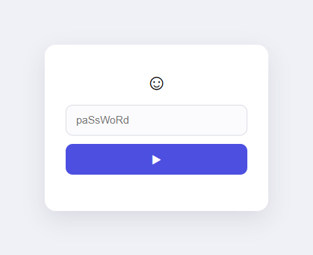

# phpLindung

A single-file PHP gate you drop in front of a page to require a username/password before it loads. It also has a "polymorphic" mode that scrambles the login page's HTML on every render — random spacing, random casing, random junk tags, random field names — so the markup looks different on each request.

Based on the original concept from Zubrag.com, rewritten with substantial changes:
http://www.zubrag.com/scripts/password-protect.php

**NOTE:** *Lindung* is Malay for "protect."

## Usage
Add this line to the top of the page you want to lock:
```
<?php include "lindung.php"; ?>
```
Visitors will see a login prompt until they submit a valid username/password.



### Setting up credentials
`$LOGIN_INFORMATION` at the top of `lindung.php` stores bcrypt password hashes, not plaintext. Generate one per account:
```
php -r "echo password_hash('your_password', PASSWORD_DEFAULT), PHP_EOL;"
```
and paste the result in as the value for that username.

### Setting the secret key
`SECRET_KEY` signs the login session cookie. The script refuses to run until you replace the placeholder with a random value:
```
php -r "echo bin2hex(random_bytes(32)), PHP_EOL;"
```
Anyone who has this value can mint their own valid login session, so keep it private and out of version control for a real deployment.

### Polymorphic settings
```
define('POLY_ON', true);         // true=enable all features, false=disable all features
define('POLY_NEWLINE', false);   // true=enable random multiline
define('POLY_SPACE', true);      // true=enable random white spaces if found any single space
define('POLY_CAPITAL', true);    // true=all character will be randomly in either upper or lower case
define('POLY_GARBAGE', true);    // true=add multi line of random html tag, comments, etc.; Limited to newline only
```
**NOTE:** See the comments in `lindung.php` for the rest of the configuration options.

## Features
1. Random spacing
2. Random capitalization
3. Random newlines
4. Random hidden junk markup
5. Randomized field names
6. Signed, expiring session cookie
7. Modern, minimalist card UI
8. Rate-limited login attempts

## Changelog

### Security fixes
- **Passwords are now hashed.** `$LOGIN_INFORMATION` used to hold plaintext passwords in source; it now holds `password_hash()` output, checked with `password_verify()`.
- **Session cookie is now a signed, expiring token instead of a static hash.** The old cookie was `md5(username + password)` — a fixed value with no expiry of its own, so a copied cookie kept working forever if replayed directly (the timeout was only ever enforced by trusting the browser to delete the cookie on time). The new cookie is an HMAC-signed token that embeds its own expiry, verified on the server on every request — the timeout is now actually enforced, and a tampered or expired token is rejected regardless of what the browser does.
- **Cookies now carry `HttpOnly`, `Secure` (auto-detected over HTTPS), and `SameSite=Lax`.** Previously the cookie had none of these, making it readable by any injected script and shippable cross-site.
- **Logout now actually expires the cookie.** It previously cleared the cookie's value but set its expiry to a *future* timestamp (the normal session length) instead of a past one.
- **Removed the "hourly rotating secret" scheme.** The old cookie *name* and secret were derived from a hardcoded string plus the current server hour — but that hardcoded string ships in this public source, and the hour has only 24 possible values, so it added no real protection while causing sessions to silently drop every time the hour rolled over, independent of the configured timeout.
- **Comparisons hardened against type juggling.** Password/session checks used loose `==`/`!=`/`in_array()` comparisons; now use `password_verify()` and `hash_equals()`, which are both type-safe and constant-time.
- The example `admin`/`henshin` credentials shipped in the file still log in out of the box for a quick trial — **change them before deploying.**

### Bug fixes
- **Disabling `POLY_CAPITAL` (or `POLY_ON`) broke the login form entirely.** The placeholder field-name tokens (`[[F_PASSWORD]]`, `[[F_SUBMIT]]`) were only ever substituted with the real field names inside the `POLY_CAPITAL` branch, so turning that setting off — or turning polymorphism off altogether — shipped a login form whose fields could never match what the server expected, making login impossible.
- **`POLY_SPACE` silently discarded `POLY_CAPITAL`'s output.** Each transform was meant to build on the last, but the spacing step ran on the original input instead of the already-capitalized text, so enabling both together dropped the capitalization.
- Fixed a related risk where the spacing transform could return an undefined value if invoked outside its normal call path.
- The optional username field used `type='input'`, which isn't a real HTML input type; it's now `type='text'`.

### UI refresh
- The login page is now a centered card with a soft shadow, rounded corners, generous spacing, and a modern system-font look, instead of the old bare unstyled form.
- Styling stays entirely in inline `style=""` attributes (no `<style>` block, no classes/ids) so it remains fully compatible with the polymorphic scrambling — every property name/value is CSS-case-insensitive, so `POLY_CAPITAL`/`POLY_SPACE`/`POLY_GARBAGE` can still scramble the whole page, styling included, without breaking it. The trade-off is no hover/focus states, transitions, or dark-mode media query, since those require a `<style>` block that scrambling would break.
- The error message is now a styled banner instead of plain red text.

### Hardening
- **`SECRET_KEY`'s placeholder check is no longer a single exact-string match.** It previously compared against one literal default value, so a trivial edit (e.g. appending a character) satisfied the check without producing an actually-random secret. It now rejects anything starting with `CHANGE_ME` or shorter than 20 characters.
- **Genuine PHP 5.5 support.** `hash_equals()` (used to verify the session token) isn't available until PHP 5.6, so the script previously fataled on PHP 5.5 despite claiming to support it. A small constant-time polyfill is now included for `hash_equals()` when the built-in isn't present.
- **Login page now sends `X-Frame-Options: DENY` and `X-Content-Type-Options: nosniff`.** Stops the login form from being framed by another site (clickjacking) and from being MIME-sniffed.
- **Added `TRUST_PROXY_HEADERS`** (default `false`) for deployments behind a reverse proxy/load balancer that terminates TLS upstream. Without it, the cookie's `Secure` flag only looks at `$_SERVER['HTTPS']`, which is empty when PHP receives a forwarded plain-HTTP request even though the original connection was HTTPS. Enable it **only** if you trust your proxy to set `X-Forwarded-Proto` honestly — the header is otherwise client-controllable and unsafe to trust directly from the internet.

### Rate limiting
- **Failed login attempts are now rate-limited per client IP.** After `RATE_LIMIT_MAX_ATTEMPTS` failures (default 5) within `RATE_LIMIT_WINDOW_SECONDS` (default 5 minutes), that IP is locked out of *submitting* login attempts for `RATE_LIMIT_LOCKOUT_SECONDS` (default 5 minutes) — even a correct password is rejected while locked out, showing a "try again in N minutes" message instead. A successful login clears that IP's counter.
- State is stored as one small JSON file per IP (named by a salted hash, not the raw address) under a per-deployment subfolder of the system temp directory, so no database or writable web-root directory is required — keeping this a single-file drop-in. Storage failures fail *open* (rate limiting is skipped, not "site down") rather than letting a broken temp directory lock everyone out.
- Client IP detection respects `TRUST_PROXY_HEADERS`: it only reads `X-Forwarded-For` when that's enabled, otherwise it uses `REMOTE_ADDR` directly — consistent with how the `Secure` cookie flag decides whether to trust proxy headers.
- Turn it off entirely with `define('RATE_LIMIT_ON', false)` if you don't want it (e.g. you already rate-limit at a proxy/WAF layer).

## Limitations
1. Some of the randomization is cosmetic obfuscation, not a substitute for HTTPS or a real authentication system — treat this as light protection for low-stakes pages, not a hardened login system.
2. Random capitalization can interfere with URLs or hotlinks placed inside the protected page's markup.
3. Not tested on mobile browsers — expect rough edges.
4. Requires PHP 5.5+ (for `password_hash`/`password_verify`, with a bundled polyfill for `hash_equals()` on 5.5); PHP 7.3+ gets native `SameSite` cookie support, older versions fall back to a compatible method.
5. Rate limiting is per-IP and file-based, so it resets if the temp directory is cleared, and shared IPs (e.g. NAT/office networks, VPNs) share the same attempt counter.

## License
1. GNU General Public License v3.0
2. Feel free to modify and reuse.

## References
1. http://www.zubrag.com/scripts/password-protect.php
